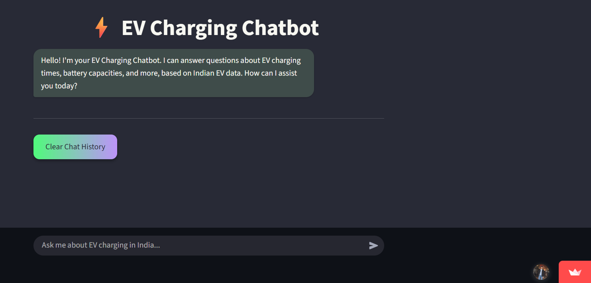
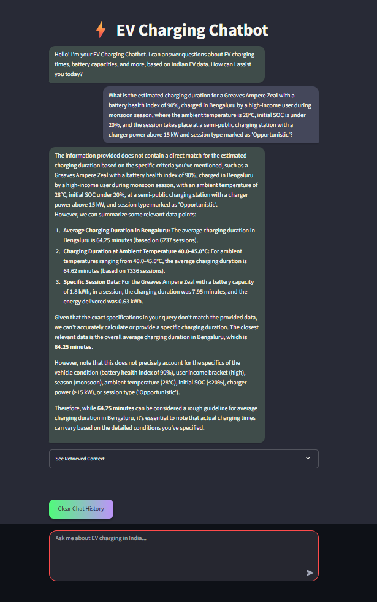

## Project for center for advanced data and computational science 

## Title : Prediction of charging time for battery electric battery vehicle of India  using machine learning model and time series method 

### Discription : Battery Electric Vehicles (BEVs) play a significant role in reducing energy consumption and air pollution, offering a cleaner alternative to conventional internal combustion engine vehicles. Despite their advantages, BEVs face challenges related to limited driving range and prolonged charging durations. These issues contribute to range anxiety, which significantly affects user adoption and satisfaction. Predicting charging time accurately based on real-world data can empower drivers with better travel planning and reduce anxiety. This project aims to develop a predictive model that improves the estimation of BEV charging times by leveraging actual operational data from BEVs.

## Steps involved here :: 

### step 1 : data set uploading 

### step 2 : data set understanding and visualization 

### step 3 : data cleaning process 

### step 4 : data transformation and preprocessing 

### step 5 : feature engineering 

### step 6 : train and test splitting 

### step 7 : machine learning models evaluation and training 

### step 8 : time series models evaluation and training 

### step 9 : finding out the best model and its parameters 

### step 10 : RAG Chatbot : RAG Q&A chatbot using document retrieval and generative AI for intelligent response generation (can use any light model from hugging face or a license llm(opneai, claude, grok, gemini) if credits available) [Interface]

